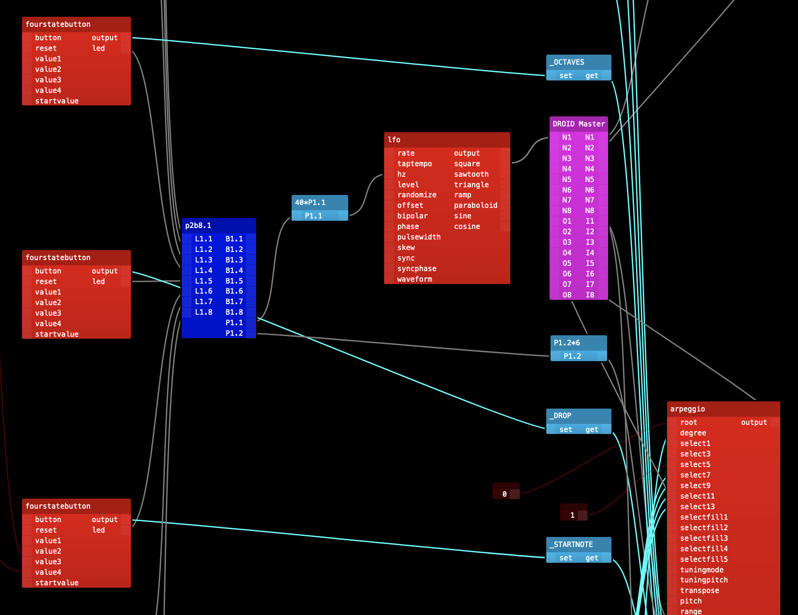

# droid-graph

Parser and visualizer for the mighty [DROID CV Processor](https://shop.dermannmitdermaschine.de/pages/droid-universal-cv-processor).

## Usage

- install node16+ & yarn
- `yarn install`
- `yarn dev`

### Changing patches

- Add your patch in `./lib/graph/patches`.
- Edit the `./lib/graph/index.ts` to load your patch
- If your patch can't be read, try to fix the parser and submit a PR!

## Notes

- This uses the `circuits.json` and patches from the `magenta-2` beta firmware.
- This is just for fun, I'll try to help on discord but you're mostly on your own.

## Shoutouts

- [Mathias Kettner](https://dermannmitdermaschine.de) - the droid creator
